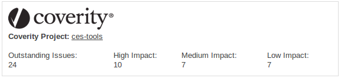

Coverity Sonar Plugin
=====================

The Coverity Sonar Plugin automatically import issues from Coverity Connect into SonarQube.

Coverity® Sonar Plug-in Installation and Configuration Guide
============================================================

Version 1.5.0

Released February 26, 2016

This guide is intended to assist you with the installation and
configuration of the Coverity Sonar plug-in. Once completed, you will be
able to view Coverity Analysis issues within the SonarQube environment.

Compatibility
=============

The table below displays the software versions supported by the Coverity
Sonar plug-in.

| **Software**     | **Supported versions** |
|------------------|------------------------|
| SonarQube        | 5.3                    |
| SonarRunner      | 2.4                    |
| Coverity Connect | 7.6+                   |

Installing the Coverity Sonar Plug-in
=====================================

To install the Coverity Sonar plug-in, complete the following steps.

1.  Ensure that you have SonarQube v5.3 and SonarRunner v2.4 installed.
    Sonar installation and setup instructions are located at
    <http://docs.codehaus.org/display/SONAR/Setup+and+Upgrade>.

2.  Download and unzip the Coverity Sonar plug-in to the Sonar plugins
    folder:

    &lt;SonarInstallDirectory&gt;/extensions/plugins

3.  Restart SonarQube.

Configuring the Coverity Sonar Plug-in
======================================

Once installed, you must configure the Coverity Sonar plug-in for
general use.

1.  Log in to SonarQube as an administrator.

2.  Navigate to the **Settings &gt; Coverity** page.

3.  Enter the appropriate information in each of the fields for your
    Coverity Connect instance. Ensure that the **Enable Coverity**
    option is set to “True” to allow the import of Coverity data.

4.  Click **Save Coverity Settings** to complete the
    basic configuration.

Configuring your Project Settings
=================================

After configuring the general plug-in settings, you must select the
correct Coverity Connect project to associate with each of your Sonar
projects.

1.  Log in to SonarQube as an administrator.

2.  Ensure that you have uploaded your project at least once (with
    sonar-runner), and select the project in SonarQube.

3.  Navigate to the **Configuration &gt; Quality Profiles** menu.

4.  Change the Quality Profile option for your project to
    *Coverity (&lt;language&gt;)*, and click **Update.**

5.  Navigate to the **Configuration &gt; Settings &gt; Coverity** page.

6.  Ensure that the **Enable Coverity** option is set to “True” to allow
    the import of Coverity data.

7.  Enter the name of the Coverity Connect project that corresponds to
    the current Sonar project.

8.  Click **Save Coverity Settings. **

Once completed, SonarQube will pull the current Coverity Analysis data
whenever you run sonar-runner on the specified project. This
configuration must be completed for each project you wish to link with
Coverity Connect.

Setting Up sonar-project.properties
===================================

For the plug-in to successfully display Coverity defects, the correct
source paths must be entered in the sonar-project.properties file at the
root of the project you are scanning. The sonar.sources variable must
contain the absolute path names of the source files. For example, on a
Linux system, the variable’s setting might look like this:

sonar.sources=/home/gwen/source/ces-tools/src/main/java

On windows it might look like this:

> sonar.sources=C:\\\\Users\\\\gwen\\\\source\\\\ces-tools\\\\src\\\\main\\\\java

See below for a complete example sonar-project.properties file. Note
that you must explicitly set the sonar.language value to your project’s
language:

> \# Required metadata
>
> sonar.projectKey=My-Project-Key
>
> sonar.projectName=My-Project-Name
>
> sonar.login=admin
>
> sonar.password=admin
>
> sonar.host.url=http://localhost:9000
>
> sonar.projectVersion=1.5.0
>
> \# Comma-separated paths to directories with sources (required)
>
> sonar.sources=.
>
> \# Language
>
> sonar.language=c
>
> \# The profile used by sonar can be specified either on the UI or by:
>
> \# sonar.profile=Coverity(c++)
>
> \# Encoding of the source files
>
> sonar.sourceEncoding=UTF-8
>
> sonar.coverity.connect.hostname=localhost
>
> sonar.coverity.connect.port=8080
>
> sonar.coverity.connect.username=user
>
> sonar.coverity.connect.password=password
>
> sonar.projectVersion=1.5.0
>
> sonar.coverity.project=MyProject
>
> sonar.coverity.enable=true
>
> \# sonar.coverity.prefix=MyOptionalPrefix

The Coverity Widget
===================

The Coverity plug-in includes a Coverity widget that displays
Coverity-specific measures. For example,

-   The Coverity logo and the Coverity Project are both clickable links
    that take you to the Coverity Connect instance. There, you can view
    the Coverity project that contributes data to your Sonar project.

-   The Outstanding Issues count is the number of outstanding Coverity
    issues found in the most recent scan.

-   The other three counts are the numbers of issues at each of
    Coverity’s three impact levels.

Limitations
===========

The Coverity Sonar plug-in has the following limitations, which may be
addressed in future releases.

-   Cannot modify data in Coverity Connect (such as triage). Data from
    Coverity Connect is read-only in Sonar.

-   A Sonar instance can only work against a single Coverity
    Connect instance.

-   Does not distinguish between Quality, Test Advisor, and
    Security issues.

-   Interacts with Coverity Connect only through web services, meaning
    the plug-in will not interact with build or analysis, and source
    code is separately maintained between Coverity Connect and Sonar.

-   No parsing of source code – the plug-in is language agnostic.

-   No creation of related Coverity Connect projects in Sonar.

-   The file paths must match exactly in Sonar and Coverity Connect;
    otherwise issue data will not be imported. However, because Coverity
    Analysis may not be performed on the same directory as Sonar
    Analysis, you may remove the beginning of the filename to make it
    relative to Sonar’s project root.

> To do so, navigate to the “Configuration -&gt; Settings -&gt;
> Coverity” menu, and specify the prefix to be removed in the “Coverity
> Files Prefix” field.

-   There are no immediate plans for localization to languages other
    than English.

Changelog
=========

* __1.5.0__
  * Upgraded web services from v6 to v9.
  * Fixed issue of Dismissed defects being counted.
  * Coverity Metrics are set to have integer values so other plugins can use our information for statistics and other computations.
  * More rules definitions for all supported languages.
  * Fixed bug of C++ headers not being scanned.
  * Fixed bug of Coverity defects with no main event not being counted.

